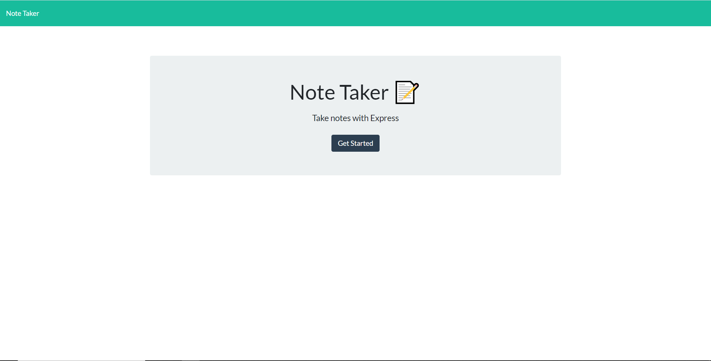
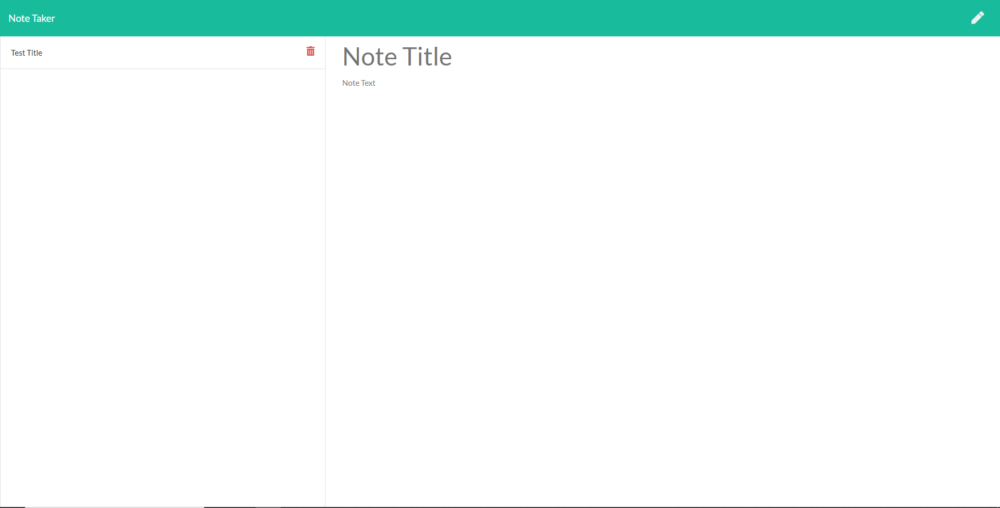

# Note Taker
## Table of Contents
* Description
* Installation
* Usage
* Licensing
* Tests
* Questions
## Description
This application is used to create and save notes for future reference. Notes can be created and deleted afterwards.
## Installation
To install Note Taker application, the user must clone the repo to your local machine, install the web framework for node express package `npm install express` command, and install uuid package for testing through `npm install uuid` command to create a unique id for each note entry.
## Usage
The purpose of this application is for users that would like an easy way to create, organize, save, and delete notes.

## Licensing

## Tests
Users can test the application through Insomnia.
## Questions
* My repositories can be found at https://www.github.com/aseppala98
* For any questions regarding this application, you can email me at SeppalaErin98@gmail.com